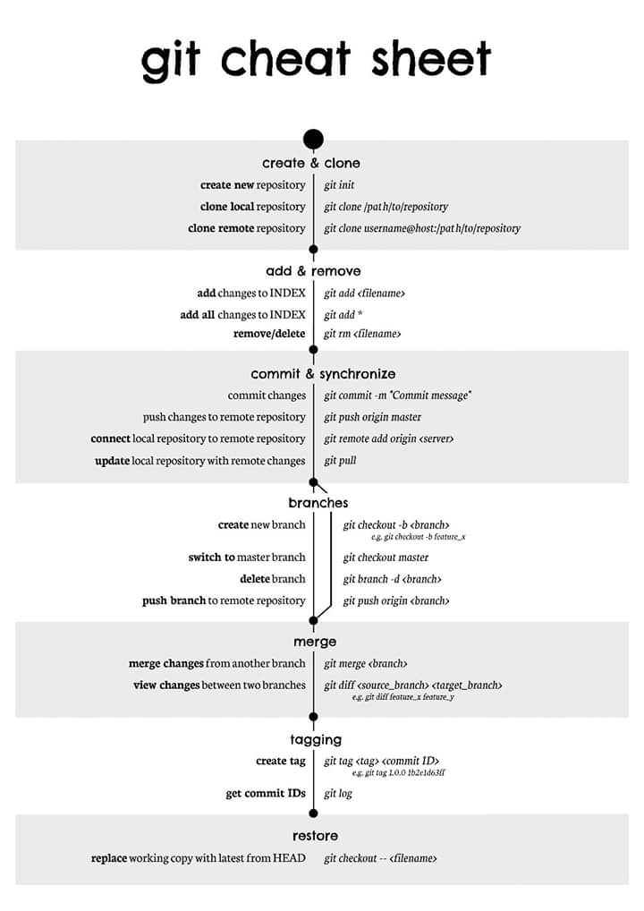

# Guia de comandos de Github

>Luego de seguir el tutorial de configuración de entorno :
[Link](https://www.taringa.net/+info/como-configurar-github-en-pc_h15ru).
>La pc está lista para manejar repositorios.
>Existen dos posibilidades, que se inicie con un repositorio nuevo o uno que ya tiene archivos en el.

## En el caso de un repositorio nuevo (vacio).

### Primer paso (pc).

Crear una carpeta para almacenar todos los archivos del proyecto.

Luego usar bash para moverse hasta la carpeta del proyecto.

--------
**Comando `cd`**

Ejemplo:

`cd D:`

Sirve para moverse a la riz  de la partición de nombre D (si la hubiera)

Ejemplo 2:

`cd C:\web`

Sirve para moverse a la carpeta "web" que se encuentra en la unidad C (partición de disco duro)

**Comando `ls`**

Sirve para visualizar los archivos, carpetas u otros en la ruta actual.

---------

#### Con la ayuda de los comandos anteriores debemos situarnos en la carpeta previamente creada (proyecto).

Luego creamos una instancia de git con el siguiente comandos.

*`git init`*

a continuación configuraremos la conexión de la carpeta del proyecto con el repositorio en nuestra cuenta de github en la nube.

*`git remote add origin git@github.com:nombreUsuario/nombreproyecto.git`*

Luego de esto ya no necesitaremos los comandos anteriores (git) de nuevo ya que la carpeta del proyecto ya estara conectada con el proyecto en la nube.

Lo que sigue es enviar cambios, archivos, carpetas, imagenes, etc.

Lo primero es añadir nuevos archivos.

-------
*Como enviar cambios a repositorio remoto*

`git add .`

El anterior comnado es para añadir todos los archivos nuevos en la carpeta del proyecto.

`git add <nombre_archivo`

Este comando es para subir algun archivo en particular.

Luego es nombrar el commit (paquete de cambios que se enviarán al repositorio en la nube).

`git commit -m "nombre_de facil_identificación"`

Por ultimo es enviar los cambios al repositorio en la nube.

`git push origin -u master`

------------------------------------------------
#### En el caso de un repositorio con datos.

El primer paso(pc).

crear una carpeta para almacenar todos los archivos del proyecto.

Luego usar git bash para moverse hasta la carpeta del proyecto.

-------------

Con ayuda del comando `cd`.

Ejemplo:

`cd D:`

Sirve para moverse a la raiz de la particion de nombre D (si la hubiera).

Ejemplo 2:

`cd C:\web`

Siver para movilizarse a la carpeta "web" que se encuentra en la unidad C (particion de disco duro)

Comando `ls`

Sirve para visualizar los archivos, carpetas u otros en la ruta actual.

----------------

#### Como crear nuevas ramas (branches) y moverse entre ellas

Tener en cuenta que para crear una nueva rama se tiene que estar dentro de la carpeta del proyecto.

Luego se ejecuta el siguiente comando.

`git checkout -b Nombre_rama`

y automaticamente aparecerá el nombre de la nueva rama en vez de la rama "master" al costado de la ruta.
En caso se quiera regresar a la rama master, ejecutar

`git checkuot master`

De esta forma regresando a la rama "master", analogamente puedes moverte a cualquier rama, previamente creada, con el mismo comando cambiando "master" por la rama destino.

**Extra**

[Workflow](https://www.atlassian.com/git/tutorials/comparing-workflows/gitflow-workflow)
